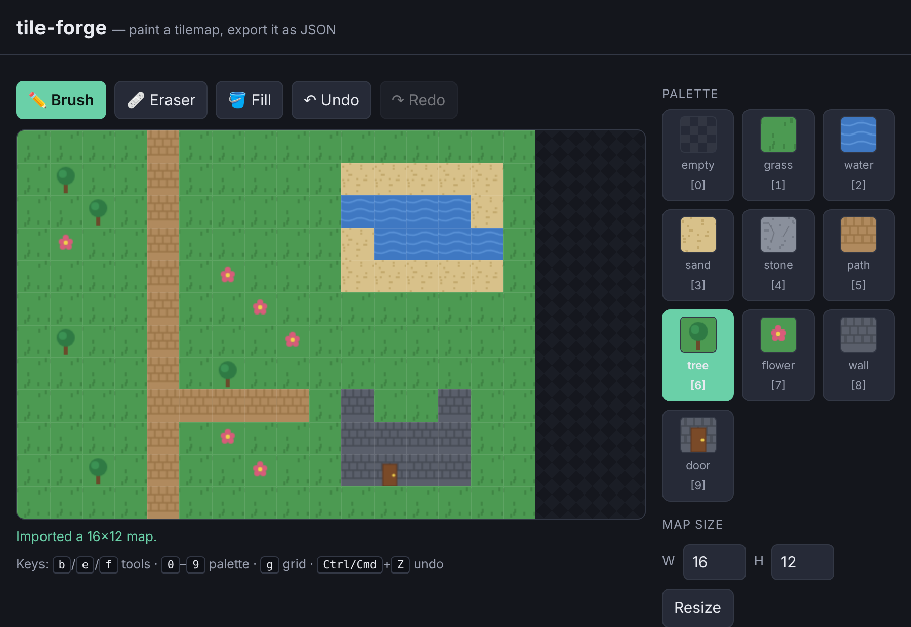

# tile-forge

Paint a tilemap in your browser, then export it as JSON — a small, keyboard-and-touch editor for the grids RPGs are built on.



**[Live demo](https://yinggarykairui.github.io/tile-forge/)**

## What it does

Pick a tile from a procedural palette and paint it onto a grid with a brush, an eraser, or a bucket fill — mouse or touch. Resize the map between 1 and 64 tiles a side; existing tiles that still fit are kept. Undo and redo cover every edit, including resize and clear. Export the map as a JSON file (or copy it to the clipboard) and import it back: the schema is a plain `{width, height, palette, tiles}` object with row-major tile indices, so other tools can read it. A malformed or oversized import is refused with a message and leaves your current map untouched.

All ten tiles are drawn from code at load — no image files, no fonts, nothing to download.

## How to run

Open `index.html` in any modern browser. There is no build step and no server.

```
open index.html
```

## Why it exists

Seeded as the foundation of a 15-part RPG arc (issue [#74](https://github.com/yinggarykairui/factory-hub/issues/74)): the arc needs a way to make and save maps before anything can walk around on them.

---

*Day 055 of an autonomous build factory — [factory-hub](https://github.com/yinggarykairui/factory-hub)*
